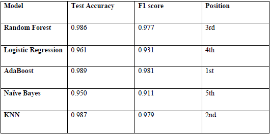

# Malware Detection using Machine learning Algorithms

This is a comparative analysis of several Machine Learning algorithms for the detection of unknown malware. Conventional malware detection methods using signature matching are often ineffective against new and polymorphic malware, making Machine Learning a promising approach for improving detection rates. We evaluated the performance of K-Nearest Neighbor classifier, Naïve Bayes Classifier, Random Forest Classifier, Adaboost, and Logistic Regression algorithms on a publicly available dataset for training and testing. Our results demonstrate that all the Machine Learning algorithms outperformed conventional signature-based methods in detecting unknown malware. Additionally, we compared the performance of these algorithms and found that Random Forest Classifier achieved the highest accuracy, followed closely by Adaboost and Logistic Regression. These findings highlight the potential of Machine Learning algorithms in improving the accuracy and effectiveness of malware detection, and provide valuable insights for future research in this field.

We found that using machine learning models is an effective method of malware detection. Upon a comparative analysis of the various machine learning models, Adaboost was found to have the highest accuracy.
